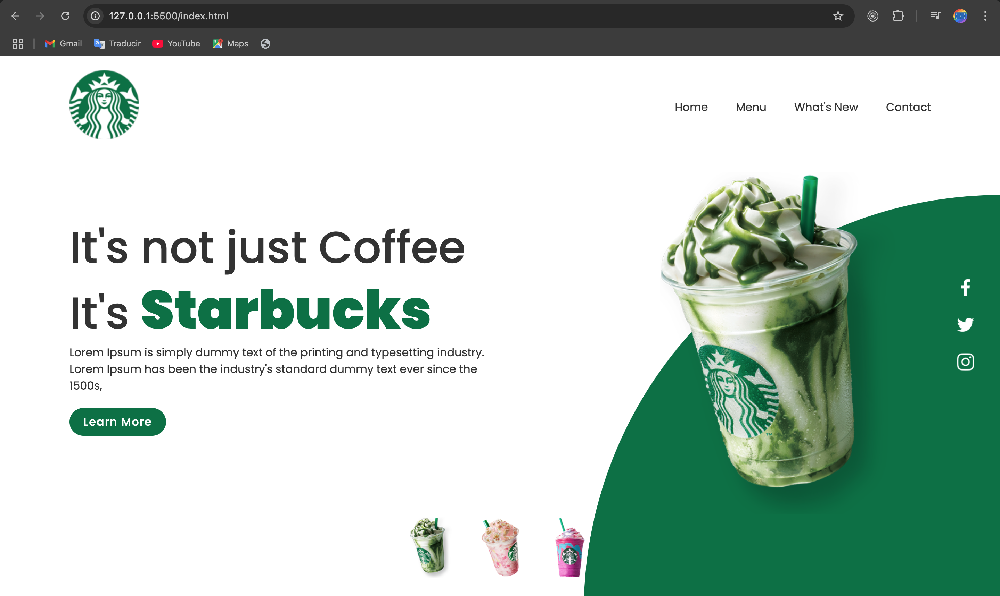

##  Starbucks Landing Page

> This is an example of a Starbucks Landing page, made with HTML, CSS, and JavaScript, it has nice thumbnail onclick events.



## Built With

- HTML
- CSS
- JavaScript

## Live Demo

[Live Demo](https://illustrious-muffin-07a442.netlify.app/)


## Getting Started

To get a local copy up and running follow these simple example steps.

- Go to the main page of te repo.
- Press the ```Code``` button and get the repo link.
- Clone it using git.

## Authors

**Cecilia Benitez**

- [@Ceci007](https://github.com/Ceci007)


## Contributing

Contributions, issues and feature requests are welcome!

Feel free to check the [issues page](https://github.com/Ceci007/starbucks-landing-page/issues).

## License

This project is [FIUNA](https://www.ing.una.py/FIUNA3/) licensed.